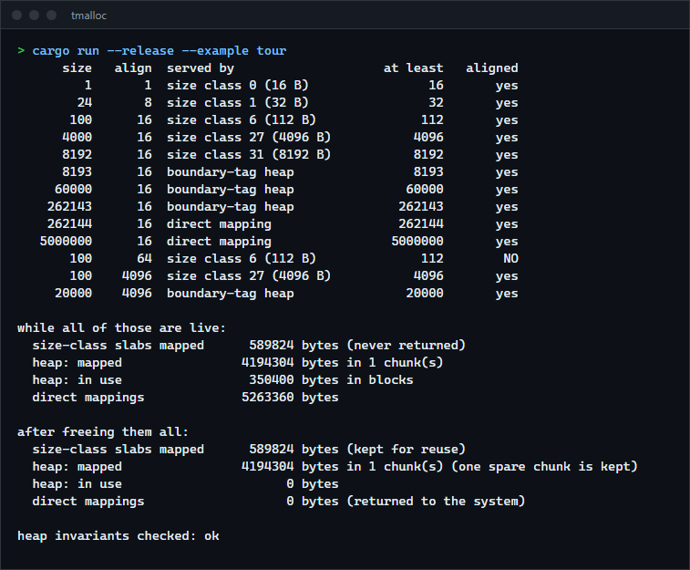
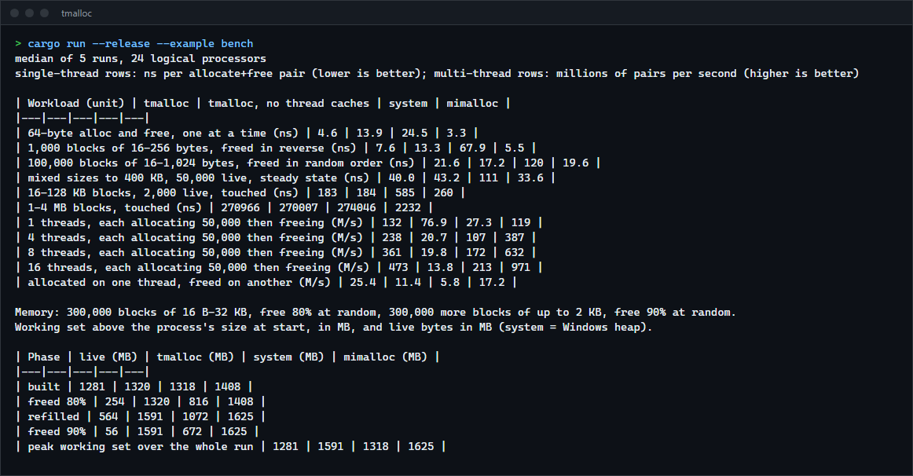

# tmalloc

A general-purpose memory allocator in Rust that installs as `#[global_allocator]`: size classes with lock-free per-thread caches for small blocks, a boundary-tag heap with coalescing for medium ones, direct mappings for large ones. For anyone who wants to read how a `malloc` is built, or to compare one against the system allocator and mimalloc with the numbers shown.

**Status:** v0.1.0, working and tested on Windows x86-64. The library is compile-checked for Linux (musl); the Unix `mmap` and pthread-key code paths have never been run. Not published to crates.io.



## How requests are served

| Request | Path | Notes |
|---|---|---|
| up to 8 KiB | size classes | 32 classes, at most 25 percent rounding; per-thread cache in front of a shared pool |
| 8 KiB up to 256 KiB | boundary-tag heap | segregated free lists, splitting, coalescing, chunks returned to the system; one lock |
| 256 KiB and up | direct mapping | straight from the system, returned on free |
| alignment above 64 KiB | system allocator | delegated |

The path is a pure function of the request's size and alignment, and `dealloc` is given the same layout as `alloc`, so small blocks carry no header.

## How to install

Requires a recent stable Rust (built and tested with 1.98.1). Not on crates.io; use it as a git dependency:

```toml
[dependencies]
tmalloc = { git = "https://github.com/r3clusionn/memory-allocator" }
```

On Windows it uses `windows-sys`; on Unix, `libc`. Nothing else.

## How to use

```rust
use tmalloc::Tmalloc;

#[global_allocator]
static ALLOC: Tmalloc = Tmalloc::new();

fn main() {
    let v: Vec<u64> = (0..1_000_000).collect();
    let s = ALLOC.stats();
    println!("{} bytes of slabs, {} in the heap, {} direct", s.small_mapped, s.heap.mapped, s.huge_mapped);
    ALLOC.check_heap().unwrap(); // walks every block and free list (slow; for tests)
    drop(v);
}
```

| API | Meaning |
|---|---|
| `Tmalloc::new()` | `const fn`, so it can be a `static`. `Tmalloc<false>` disables the per-thread caches. |
| `stats()` | Bytes mapped for size-class slabs, for direct mappings, and the heap's counters (mapped, in use, peak, allocations, frees). |
| `check_heap()`, `check_pools()` | Verify every invariant of the heap, the thread caches and the shared pools. Slow; used by the tests. |
| `route(size, align)` | Which path a request takes. |
| `heap::Heap` | The boundary-tag heap on its own (single-threaded), with `alloc`, `free`, `realloc_in_place`, `usable_size` and `check`. |

An instance must not be moved after it has served a request and must outlive every thread that used it; a `static` does both.

## Benchmarks

Windows 11, Intel Core i9-14900KF (24 logical processors), 32 GB RAM, Rust 1.98.1, release build with LTO (`cargo run --release --example bench`). Median of 5 runs. Threads are not pinned. All allocators are driven through the same `GlobalAlloc` calls, each in a function the compiler may not inline and with sizes it cannot see, because a size-class lookup that folds away at compile time would flatter an allocator written in Rust against mimalloc's opaque C calls. "system" is Rust's `System` allocator, which is the Windows process heap. "mimalloc" is the `mimalloc` crate 0.1.52 with default settings.



Single thread, nanoseconds per allocate-plus-free pair (lower is better):

| Workload | tmalloc | tmalloc without thread caches | system | mimalloc |
|---|---|---|---|---|
| 64-byte block, one at a time | 4.6 | 13.9 | 24.5 | 3.3 |
| 1,000 blocks of 16-256 bytes, freed in reverse | 7.6 | 13.3 | 67.9 | 5.5 |
| 100,000 blocks of 16-1,024 bytes, freed in random order | 21.6 | 17.2 | 120 | 19.6 |
| mixed sizes to 400 KB, 50,000 live, steady state | 40.0 | 43.2 | 111 | 33.6 |
| 16-128 KB blocks, 2,000 live, touched | 183 | 184 | 585 | 260 |
| 1-4 MB blocks, touched | 270,966 | 270,007 | 274,046 | 2,232 |

Threads each allocating 50,000 small blocks and then freeing them, millions of pairs per second over all threads (higher is better):

| Threads | tmalloc | tmalloc without thread caches | system | mimalloc |
|---|---|---|---|---|
| 1 | 132 | 76.9 | 27.3 | 119 |
| 4 | 238 | 20.7 | 107 | 387 |
| 8 | 361 | 19.8 | 172 | 632 |
| 16 | 473 | 13.8 | 213 | 971 |
| allocated on one thread, freed on another | 25.4 | 11.4 | 5.8 | 17.2 |

What the numbers say:

- **Against the Windows heap, tmalloc is 3 to 9 times faster** on every small and medium workload, and about 2 times faster at 4 to 16 threads. On 1-4 MB blocks they are equal: both map and unmap on every call and the time is the kernel's.
- **Against mimalloc, it is 1.1 to 1.4 times slower on small single-thread work, faster on 16-128 KB blocks (1.4 times) and when freeing on another thread (1.5 times), and slightly faster (1.1 times) on one thread of the multi-thread test.** mimalloc scales better: 1.6 times faster at 4 threads and 2.0 times at 16.
- **mimalloc is about 120 times faster on 1-4 MB blocks** because it keeps freed mappings for reuse while tmalloc returns them. This is a design difference, not a tuning gap.
- **The per-thread caches are the point:** without them every small request takes a shared lock, and throughput falls from 77 to 14 million pairs per second as threads are added.
- Not measured: latency percentiles, contention on the 8 KiB to 256 KiB path (it has one lock; the medium test is single-threaded), long-running fragmentation, other hardware, Linux.

Memory, one process per allocator: 300,000 blocks of 16 B to 32 KB (every byte written), free 80 percent at random, allocate 300,000 more of up to 2 KB, free 90 percent at random. Working set above the process's size at the start, in MB:

| Phase | live | tmalloc | system | mimalloc |
|---|---|---|---|---|
| built | 1,281 | 1,320 | 1,318 | 1,408 |
| 80 percent freed | 254 | 1,320 | 816 | 1,408 |
| refilled | 564 | 1,591 | 1,072 | 1,625 |
| 90 percent freed | 56 | 1,591 | 672 | 1,625 |
| peak | 1,281 | 1,591 | 1,318 | 1,625 |

When nothing has been freed tmalloc adds about 3 percent over the live data. It does not give small memory back, though: after 90 percent is freed it still holds 1.59 GB against the Windows heap's 0.67 GB, and mimalloc, which also keeps freed memory, holds about the same. A likely reason in tmalloc's case is that the second phase's small blocks cannot reuse memory freed in the larger classes; this was not isolated.

## Verification

55 tests: 42 unit, 7 with tmalloc as the process's global allocator, 4 multi-threaded model tests, 1 thread-exit test and 1 doctest. `cargo test --release` runs them; `scripts/soak.sh` repeats the whole suite and keeps the output of any failing run (100 consecutive runs of the final code passed; an earlier version failed once in a run that was not reproduced afterwards, and the likely cause was a test that dropped an allocator before its threads had finished exiting, fixed as described below).

| Check | What it covers |
|---|---|
| Heap invariant checker | After every operation in the tests: every block's size, alignment, `PREV_INUSE` bit and footer; no two free blocks adjacent; every free block in the right bin with consistent links and bitmap; chunk, in-use and spare counters equal what the walk finds. |
| Random model tests | Up to 40,000 random alloc, free, in-place realloc and aligned-alloc operations on the heap, checked against a separate record of live blocks: no two overlap, every byte written is still there when freed. |
| Threaded model tests | 8 threads over every path (sizes from 1 byte to 2 MB, alignments to 64 KiB, zeroed allocations, realloc across paths) with blocks handed to other threads to free; content patterns verified on every free. |
| Pool and cache checker | Cache counts equal list lengths, caches stay under the flush threshold, every pooled batch holds exactly one batch of objects. Exact accounting after thread exit: every object a thread obtained is back in the pool. |
| Global allocator tests | Collections, a vector growing from bytes to tens of megabytes, zeroed memory after reuse, sorting, channels moving memory between threads, thousands of short-lived threads. |
| Thread exit | Threads whose own thread-local destructors allocate and free around the allocator's exit hook, 3,600 of them, then the pools checked. |

Mutation checks (break one thing, confirm a test fails): 46 changes to the heap, the size classes and the small-block code, such as skipping a coalesce, writing no footer, a wrong split threshold, a flush that walks one object too far, a cache slot that is not released, a thread that keeps another instance's cache. 45 are caught (several only by a crash or an endless loop, which the script counts as caught). The one that survives is equivalent: the last object of a freshly carved batch is not terminated with a null, but fresh slab memory is zero from the system so it already is; the code writes the terminator anyway.

What went wrong along the way, all in the tests or the benchmark and none in the allocator: the exit test could not notice a lost remainder (a mutant survived, so the test was rewritten around threads freeing each other's blocks with exact accounting); tests inspected the pools, and one dropped an allocator, while worker threads were still inside their exit callbacks, because a scoped thread's closure finishes before the thread has exited (the tests now wait for the exit); and the first benchmark gave tmalloc an unfair compile-time advantage, corrected as described above.

## How it works

- **The heap** (`src/heap.rs`). Chunks of 4 MiB are carved into blocks. A block has an 8-byte header holding its size and two flag bits (this block in use, previous block in use); a free block repeats its size in its last word and holds two list links. Blocks sit at 8 mod 16 so payloads are 16-byte aligned. Freeing reads the previous block's size from the word before and the next block's header from the word after, merges with free neighbours in constant time, and so no two free blocks ever touch. Free blocks live in 160 bins (every 16 bytes to 512, then four per doubling) with a bitmap of non-empty bins; a request takes the best of the first 64 blocks in its own bin, or the first block of the next non-empty bin. Larger alignments take an oversized block, return the gap in front as a free block and use the aligned part. A chunk that becomes entirely free is returned to the system, except for one spare.
- **Small blocks** (`src/tmalloc.rs`). Objects of a class are carved from 64 KiB or larger slabs. Each thread owns a cache slot: a free list per class, popped and pushed with no lock and no atomic. When it is empty the thread takes a batch from the class's shared pool; when it holds two batches it gives one back. The pool stores freed memory as ready-made batches, so taking or giving one is a pointer swap under a short lock however many objects it holds.
- **Thread exit** (`src/threads.rs`). A slot is released when its thread exits, so a thread cannot take a cache with it. Rust's thread-local destructors cannot do this (registering one may allocate, and the allocator is the caller), so the allocator asks the operating system instead: fiber-local storage with a destructor callback on Windows, a pthread key with a destructor on Unix, neither of which allocates. After the callback a thread's remaining frees go straight to the pools, because its slot may already belong to another thread.
- **Alignment.** Objects of a power-of-two class are carved at multiples of their size from a slab that starts on a 64 KiB boundary, so they are naturally aligned. A small request with an alignment above 16 is rounded up to such a class.

## Limits

- Small memory is never returned to the system, and memory freed in one class is not reused by another (see the memory table).
- The 8 KiB to 256 KiB path has one global lock. Many threads allocating medium blocks at once will serialise.
- Blocks of 256 KiB and up are mapped and unmapped on every call (about 270 microseconds for 1-4 MB, the same as the Windows heap, which suggests the cost is the kernel mapping and faulting in the pages), and there is no `mremap` for growing them.
- There are 256 cache slots; threads beyond that many alive at once use the shared pool one object at a time.
- Alignments above 64 KiB are delegated to the system allocator.
- Only Windows x86-64 was run. The Unix paths compile and have not been executed.
- No hardening: no guard pages or canaries, and a double free is caught only by a debug assertion in the heap. It does not export `malloc` and `free`, so it cannot be preloaded into C programs.

## License

MIT (see `LICENSE`).
